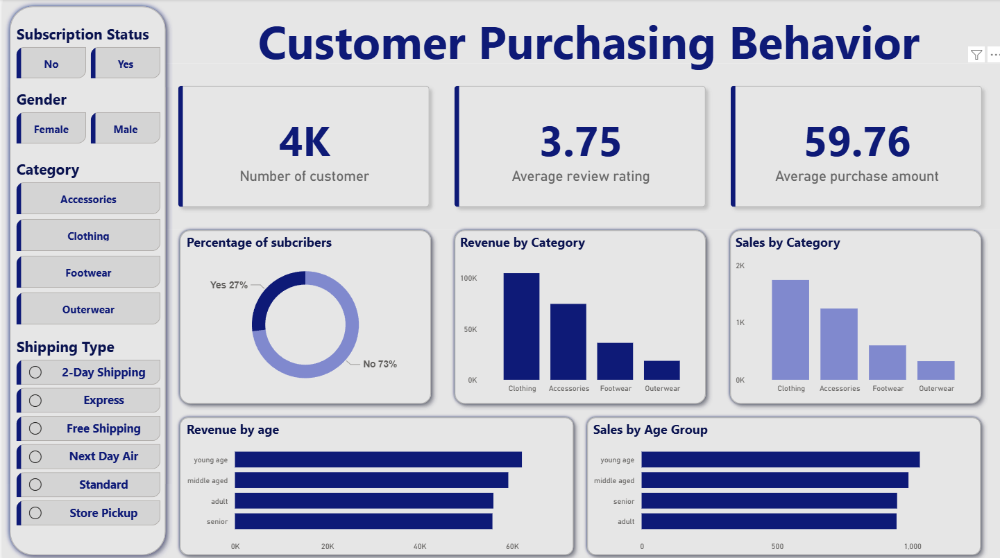

<h1 align="center">🛍️ Customer Purchasing Behavior Analysis (SQL + Python + Power BI)</h1>

  <b>An interactive Power BI dashboard powered by PostgreSQL and Python, analyzing customer purchasing behavior, subscription impact, seasonal trends, and revenue drivers.</b>

  
  
  

<h2>🔗 Table of Contents</h2>
<ul>
  <li><a href="#brief-summary">🪄 Brief One-Line Summary</a></li>
  <li><a href="#overview">📝 Overview</a></li>
  <li><a href="#problem-statement">❓ Problem Statement</a></li>
  <li><a href="#dataset">📊 Dataset</a></li>
  <li><a href="#tools-technologies">⚙ Tools & Technologies</a></li>
  <li><a href="#methods">🧮 Methods</a></li>
  <li><a href="#key-insights">💡 Key Insights</a></li>
  <li><a href="#dashboard-output">📊 Dashboard / Output</a></li>
  <li><a href="#project-structure">📁 Project Structure</a></li>
  <li><a href="#results-conclusion">📈 Results & Conclusion</a></li>
  <li><a href="#future-work">🚀 Future Work</a></li>
  <li><a href="#author-contact">👤 Author & Contact</a></li>
</ul>

<h2 id="brief-summary">🪄 Brief One-Line Summary</h2>

A customer-level behavioral analytics dashboard integrating SQL queries and Python processing to uncover purchasing patterns, subscription performance, and revenue insights.

<h2 id="overview">📝 Overview</h2>

This project provides an end-to-end customer purchasing behavior analysis using <b>PostgreSQL</b> for querying, <b>Python</b> for data processing, and <b>Power BI</b> for visualization.

The objective is to extract actionable insights from customer transaction data to improve marketing strategy, subscription models, discount policies, and seasonal planning.

<h2 id="problem-statement">❓ Problem Statement</h2>

The business aims to understand customer behavior patterns across different demographics, product categories, and purchasing conditions.
The analysis answers key questions:

<ul>
  <li>Do subscribers generate more revenue than non-subscribers?</li>
  <li>How effective are discounts and promo codes?</li>
  <li>Which product categories contribute the most revenue?</li>
  <li>How do seasonal trends influence purchasing behavior?</li>
  <li>What are the preferred payment and shipping methods?</li>
</ul>

<h2 id="dataset">📊 Dataset</h2>

<b>File:</b> <code>customer_purchase_behavior.csv</code>

<b>Type:</b> Customer-level transactional dataset

<b>Size:</b> Large dataset included in repository

<table>
  <tr><th>Column Name</th><th>Description</th></tr>
  <tr><td>Customer ID</td><td>Unique customer identifier</td></tr>
  <tr><td>Age</td><td>Customer age</td></tr>
  <tr><td>Gender</td><td>Customer gender</td></tr>
  <tr><td>Item Purchased</td><td>Product purchased</td></tr>
  <tr><td>Category</td><td>Product category</td></tr>
  <tr><td>Purchase Amount (USD)</td><td>Transaction value</td></tr>
  <tr><td>Season</td><td>Season of purchase</td></tr>
  <tr><td>Subscription Status</td><td>Subscription indicator</td></tr>
  <tr><td>Discount Applied</td><td>Discount usage flag</td></tr>
  <tr><td>Promo Code Used</td><td>Promo code usage</td></tr>
  <tr><td>Shipping Type</td><td>Delivery method</td></tr>
  <tr><td>Payment Method</td><td>Payment method used</td></tr>
  <tr><td>Previous Purchases</td><td>Number of prior purchases</td></tr>
  <tr><td>Review Rating</td><td>Customer rating</td></tr>
</table>

<h2 id="tools-technologies">⚙ Tools & Technologies</h2>

<table>
  <tr><th>Tool</th><th>Purpose</th></tr>
  <tr><td>PostgreSQL (SQL)</td><td>Data querying, transformation, aggregation</td></tr>
  <tr><td>Python (Pandas, SQLAlchemy)</td><td>Data extraction and preprocessing</td></tr>
  <tr><td>Power BI Desktop</td><td>Dashboard visualization and reporting</td></tr>
  <tr><td>GitHub</td><td>Version control and project hosting</td></tr>
</table>

<h2 id="methods">🧮 Methods</h2>

<h3>1️⃣ SQL Analysis</h3>
<ul>
  <li>Revenue aggregation by category and season</li>
  <li>Subscription vs non-subscription comparison</li>
  <li>Discount rate calculation</li>
  <li>Customer purchase frequency segmentation</li>
</ul>

<pre><code>
-- Example Query: Revenue by Category
SELECT category,
       SUM("Purchase Amount (USD)") AS total_revenue
FROM customer_data
GROUP BY category
ORDER BY total_revenue DESC;
</code></pre>

<h3>2️⃣ Python Processing</h3>
<ul>
  <li>Database connection setup</li>
  <li>Data validation and cleaning</li>
  <li>Exporting processed dataset for Power BI</li>
</ul>

<h3>3️⃣ Visualization (Power BI)</h3>
<ul>
  <li>KPI cards (Total Revenue, Avg Purchase, Subscribers)</li>
  <li>Category and seasonal breakdown charts</li>
  <li>Discount and subscription impact visuals</li>
  <li>Interactive filters for deep analysis</li>
</ul>

<h2 id="key-insights">💡 Key Insights</h2>

<ul>
  <li>Subscribers show higher repeat purchase frequency.</li>
  <li>Discount campaigns increase short-term revenue.</li>
  <li>Certain categories dominate specific seasons.</li>
  <li>Shipping and payment preferences vary by purchase frequency.</li>
</ul>

<h2 id="dashboard-output">📊 Dashboard / Output</h2>

<b>Files:</b>

<ul>
  <li><code>Customer_Purchase_Behavior.pbix</code> — Power BI dashboard</li>
  <li><code>scripts/</code> — SQL and Python scripts</li>
</ul>

<b>Preview:</b>

<h2 id="project-structure">📁 Project Structure</h2>

<pre>
Customer-Purchasing-Behavior/
│
├── dashboard/
│   └── Customer_Purchase_Behavior.pbix
│
├── data/
│   └── Customer_Purchase_Behavio.csv
│
├── report/
│   └── Customer_Purchase_Behavior_Report.pdf
│
├── screenshots/
│   └── dashboard.png
│
├── scripts/
│   ├── sql_script.sql
│   └── python_script.py
│
└── README.md
</pre>

<h2 id="results-conclusion">📈 Results & Conclusion</h2>

<ul>
  <li>Subscription-based customers drive consistent revenue.</li>
  <li>Discounts improve transaction volume but require margin monitoring.</li>
  <li>Seasonal patterns significantly influence purchasing trends.</li>
  <li>Insights support targeted marketing and customer retention strategies.</li>
</ul>

<h2 id="future-work">🚀 Future Work</h2>

<ul>
  <li>Build predictive models for customer lifetime value</li>
  <li>Add churn prediction analysis</li>
  <li>Automate reporting pipeline</li>
  <li>Integrate real-time data updates</li>
</ul>

<h2 id="author-contact">👤 Author & Contact</h2>

<b>Author:</b> Sujal Sadh 
📧 sujalsadh113@gmail.com 
🔗 Add LinkedIn profile link here

